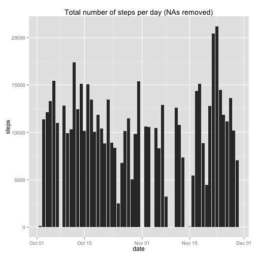
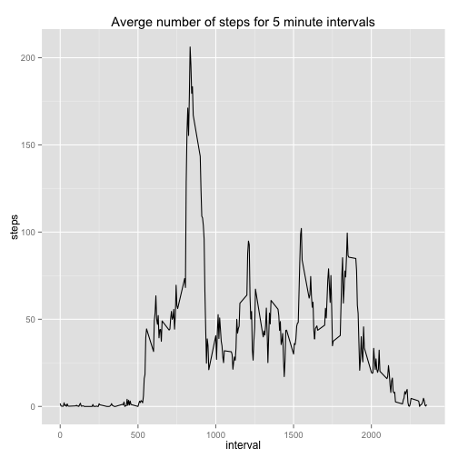
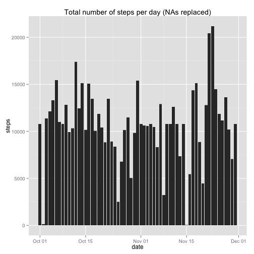
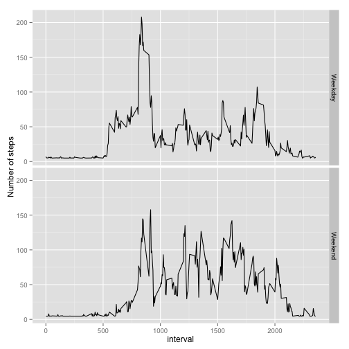

# Reproducible Research: Peer Assessment 1


## Loading and preprocessing the data

```r
setwd("~/GitHub/RepData_PeerAssessment1")
activity <- read.csv("activity.csv", colClasses = c("integer","Date","integer"))
```

## What is mean total number of steps taken per day?
For this part of the assignment, you can ignore the missing values in
the dataset.

**1.** Make a histogram of the total number of steps taken each day


```r
library(dplyr)
library(ggplot2)
qplot(date, steps, data = activity %>% group_by(date), geom = "bar", stat = "identity", main = "Total number of steps per day (NAs removed)")
```

```
## Warning: Removed 2304 rows containing missing values (position_stack).
```

 

**2.** Calculate and report the **mean** and **median** total number of steps taken per day


```r
tot_steps <- activity %>% group_by(date) %>% summarise(tot_steps = sum(steps, na.rm=TRUE))
avg_steps <- mean(tot_steps$tot_steps, na.rm=TRUE)
med_steps <- median(tot_steps$tot_steps, na.rm=TRUE)
```
Mean number of steps per day: 9354.2295
Median number of steps perday: 10395

## What is the average daily activity pattern?

**1.** Make a time series plot (i.e. `type = "l"`) of the 5-minute interval (x-axis) and the average number of steps taken, averaged across all days (y-axis)


```r
qplot(interval, steps, data = activity %>% group_by(interval) %>% summarise(steps= mean(steps, na.rm=TRUE)), geom = "line", main = "Averge number of steps for 5 minute intervals")
```

 

**2.** Which 5-minute interval, on average across all the days in the dataset, contains the maximum number of steps?


```r
d1 <- activity %>% group_by(interval) %>% summarise(avg_steps = mean(steps, na.rm=TRUE))
with(d1,d1[order(-avg_steps),])
```

```
## Source: local data frame [288 x 2]
## 
##     interval avg_steps
## 104      835     206.2
## 105      840     195.9
## 107      850     183.4
## 106      845     179.6
## 103      830     177.3
## 101      820     171.2
## 108      855     167.0
## 100      815     157.5
## 102      825     155.4
## 109      900     143.5
## ..       ...       ...
```
The interval with the maximum average number of steps is **835**

## Imputing missing values

Note that there are a number of days/intervals where there are missing
values (coded as `NA`). The presence of missing days may introduce
bias into some calculations or summaries of the data.

1. Calculate and report the total number of missing values in the dataset (i.e. the total number of rows with `NA`s)

```r
summary(activity)
```

```
##      steps            date               interval   
##  Min.   :  0.0   Min.   :2012-10-01   Min.   :   0  
##  1st Qu.:  0.0   1st Qu.:2012-10-16   1st Qu.: 589  
##  Median :  0.0   Median :2012-10-31   Median :1178  
##  Mean   : 37.4   Mean   :2012-10-31   Mean   :1178  
##  3rd Qu.: 12.0   3rd Qu.:2012-11-15   3rd Qu.:1766  
##  Max.   :806.0   Max.   :2012-11-30   Max.   :2355  
##  NA's   :2304
```
There are **2304 `NA`s**

2. Devise a strategy for filling in all of the missing values in the dataset. The strategy does not need to be sophisticated. For example, you could use the mean/median for that day, or the mean for that 5-minute interval, etc.

#### Replace missing values with the daily mean

```r
act_nareplace <- activity #Duplicate original data frame
#Replace values with mean number of steps over all observations
act_nareplace$steps[is.na(act_nareplace$steps)] <- mean(act_nareplace$steps, na.rm = TRUE)
```

4. Make a histogram of the total number of steps taken each day and Calculate and report the **mean** and **median** total number of steps taken per day. Do these values differ from the estimates from the first part of the assignment? What is the impact of imputing missing data on the estimates of the total daily number of steps?


```r
qplot(date, steps, data = act_nareplace %>% group_by(date), geom = "bar", stat = "identity", main = "Total number of steps per day (NAs replaced)")
```

 

```r
summary(act_nareplace %>% group_by(date) %>% summarise(tot_steps = sum(steps)))
```

```
##       date              tot_steps    
##  Min.   :2012-10-01   Min.   :   41  
##  1st Qu.:2012-10-16   1st Qu.: 9819  
##  Median :2012-10-31   Median :10766  
##  Mean   :2012-10-31   Mean   :10766  
##  3rd Qu.:2012-11-15   3rd Qu.:12811  
##  Max.   :2012-11-30   Max.   :21194
```
New mean = 10766
New median = 10766

## Are there differences in activity patterns between weekdays and weekends?


```r
act_nareplace$weekday <- weekdays(act_nareplace$date)
act_nareplace$weekend <- act_nareplace$weekday=="Saturday" | act_nareplace$weekday=="Sunday"
act_nareplace$weekend <- ifelse(act_nareplace$weekend==TRUE,"Weekend","Weekday")

qplot(interval, steps, data = act_nareplace %>% group_by(interval,weekend) %>% summarise(steps = mean(steps)), facets = weekend~., geom = "line", ylab = "Number of steps")
```

 
